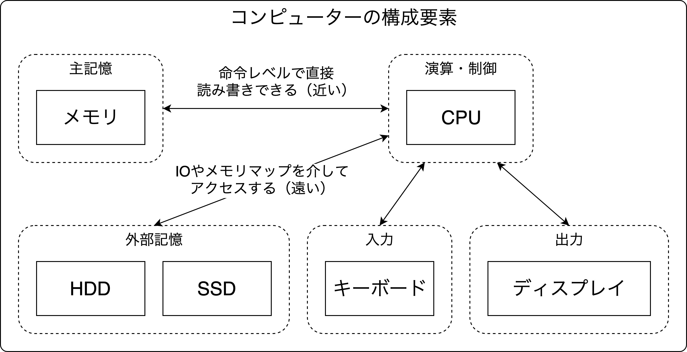

<!-- (|
  title = {OS Girls + \SATySFi;.md};
  author = {hikalium};
  pictures-by = {foo someone};
  printed-by = {bar someone};
  revisions = [
    ({1970-01-01}, {v0.0.0});
    ({2020-07-25}, {v1.0.0});
  ];
|) -->

# 登場人物

#### hikalium

OSがだいすき。[OS Girls](https://hikalium.booth.pm/items/1317230)の作者。

最近は[liumOS](https://github.com/hikalium/liumos)という自作OSをつくったり、
[低レイヤガール](https://www.youtube.com/channel/UCMsstGhINXdpMqo9tsElCMQ)というYouTubeチャンネルを
[d0iasm](https://twitter.com/d0iasm)さんと一緒にやっている。

#### SATySFi

詳細は[gfngfn/SATySFi](https://github.com/gfngfn/SATySFi)を参照。

[bd_gfngfn](https://twitter.com/bd_gfngfn)さんをはじめとする人々によって作られた新しい組版システム。
エラーメッセージがLaTeXよりもわかりやすい。OCamlっぽい文法が特徴。


## はじめに

このレポジトリは、SATySFiのMarkdown機能を使ってhikaliumがOS Girlsという技術同人誌を執筆した際の秘伝のタレを、みなさまにも味わっていただけるように抽出したものです。

とりあえず動けばいいや！（大事なのは文章自体のほうなので）という意識でやっていたため、アドホックな解決策も多く、大味なところもありますが、なにとぞ大目にみていただければ助かります。

本成果物にはMITライセンスを適用します。したがって、本リポジトリに含まれるコードは自由に再利用していただいて構いません。

もし、改善案などがありましたら、[@hikalium](https://twitter.com/hikalium)宛にTwitterでメンションしていただくか、GitHubのリポジトリでIssue/Pull requestを送っていただければと思います。

この資料によって、みなさんにもSATySFiのMarkdown機能が、単なるおまけとしてではなく、同人誌の作成にも役立つ程度には使えると感じていただけたら幸いです。

## 事前準備

このスタイルでは以下のフォントの存在を前提にしています。


```
SourceCodePro-Regular
HiraKakuGothicW2
```

いい感じに`fonts.satysfi-hash`を設定しておいてください。

## つかいかた

とりあえずMarkdownを書けばそれっぽくなります。

ただし、書籍の体裁にするために、見出しの用途を一部固定しています。

### 見出しの用途一覧

```
# h1: 章タイトル(付番なし)
## h2: 章タイトル(付番あり)(ring N:という形式)

h1, h2については、直前で改ページされます

### h3: 節タイトル（付番あり)(N.M: という形式)
#### h4: 節タイトル（付番なし)(登場人物のところで使用)

###### h6: 強制改ページ
```

なんともアドホックですね！

######

### ヘッダーを用いた表紙や奥付の生成

表紙と奥付は、以下の記述で渡されるヘッダデータを参照して生成されています。
revisionsが配列になっているというのがミソです（増刷した時にきれいに出したかったので）。

```
<!-- (|
  title = {OS Girls + \SATySFi;.md};
  author = {hikalium};
  pictures-by = {foo someone};
  printed-by = {bar someone};
  revisions = [
    ({1970-01-01}, {v0.0.0});
    ({2020-07-25}, {v1.0.0});
  ];
|) -->
```

これらの生成については、`satysfi_config/local/packages/osgirls.satyh`に実装されています。(`let bb-colophon`の行以降が奥付の生成部分です。)

######

### 参考文献のあたり

たとえばみんな大好き Intel SDM [sdm] とか UEFI Specification [uefi] とかに言及したいときは

```
たとえばみんな大好き Intel SDM [sdm] とか UEFI Specification [uefi] とか
```

と記述して、加えてどこかに

```
[sdm]: dummy 'Intel 64 and IA-32 Architectures Software Developer’s Manual (May 2019)'
[uefi]: dummy 'Unified Extensible Firmware Interface (UEFI) Specification ( Version 2.8 March 2019 )'
```

と書いておくと、いい感じにクリックして巻末の参考文献に飛べるようになります。参考文献の章は自動で最後にいい感じに生成されるので心配しなくて大丈夫です。（参考文献の量が多くなった時に奥付とかぶる問題については未解決です。）

なんかコードブロックはみ出しているけど気にしない（あとで調査します）。

######

### 画像まわり

画像のサイズ指定はできないので、がんばっていい感じにします。とりあえず、`satysfi_config/local/packages/osgirls.satyh`では

```
  let-inline ctx \img alt src title =
    use-image-by-width (load-image src) text-width
```

としておいたので、画像はページの幅いっぱいに広がります。ということで、それを念頭に画像を作ればOK。こんな感じでね。

```

```


## まとめ

The SATySFi book [saty] を参考に初心者ながらがんばってみたのですが、割と書籍っぽい体裁にMarkdownでも無理やり持っていくことが可能だということがわかりました。

まだまだ発展途上なのでがんばります。ほしい機能をSATySFiにコミットしていきたい！


[sdm]: dummy 'Intel 64 and IA-32 Architectures Software Developer’s Manual (May 2019)'

[uefi]: dummy 'Unified Extensible Firmware Interface (UEFI) Specification ( Version 2.8 March 2019 )'

[saty]: dummy 'The SATySFi book ( https://booth.pm/ja/items/1127224 )'
